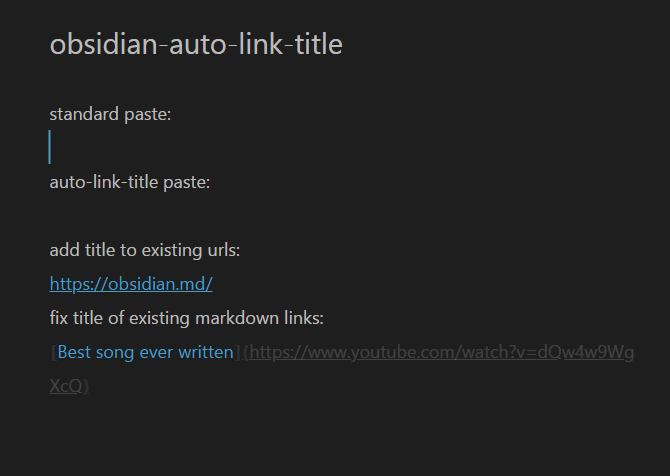
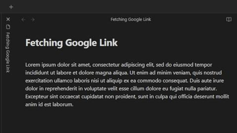
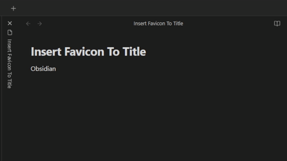

## Obsidian Auto Link Title

### Automatically Title New Links
This plugin automatically fetches the webpage to extract link titles when they're pasted, creating a markdown link with the correct title set.

#### For example:

When pasting `https://github.com/zolrath/obsidian-auto-link-title` the plugin fetches the page and retrieves the title, resulting in a paste of: `[zolrath/obsidian-auto-link-title: Automatically fetch the titles of pasted links](https://github.com/zolrath/obsidian-auto-link-title)`

### Add Titles To Existing Raw URLs
Additionally, using `ctrl-shift-e` (Windows) or `cmd-shift-e` (OS X) you can enhance an existing raw link to a markdown formatted link with the proper title.

If your text cursor is within the url `https://github.com/zolrath/obsidian-auto-link-title` pressing `ctrl-shift-e` or `cmd-shift-e` converts the text to `[zolrath/obsidian-auto-link-title: Automatically fetch the titles of pasted links](https://github.com/zolrath/obsidian-auto-link-title)`

### Overwrite Titles Of Existing Markdown Links
Additionally, using `ctrl-shift-e` (Windows) or `cmd-shift-e` (OS X) you can overwrite an existing title of a markdown link with the fetched title from the url.

If your text cursor is within `[some plugin](https://github.com/zolrath/obsidian-auto-link-title)` pressing `ctrl+shift+e` fetches the sites title and replaces it, resulting in `[zolrath/obsidian-auto-link-title: Automatically fetch the titles of pasted links](https://github.com/zolrath/obsidian-auto-link-title)`

### Fetch First Google Link Of Selected Text

You can automatically fetch the URL of the first Google result that
would come up if you googled your selected text via a command.
This has a limit of 10k request per day.

To use this feature, create an **API key** [here](https://developers.google.com/custom-search/v1/introduction) aswell as a **Custom Search Engine ID** [here](https://programmablesearchengine.google.com/controlpanel/all).
Then put the key and ID into the plugins settings.

> be sure to check the box "Search the entire web" in your engines settings

### Insert Favicons In Title of Links

This feature is disabled by default.

If the setting is enabled, the plugin will insert the favicon of the website in the title of the link. This happens when running any of the commands above.

### Mobile Pasting
In order to paste the URL ensure you perform the `Tap and Hold -> Paste` action to paste the URL into your document.

#### Gboard
Google's [Gboard](https://play.google.com/store/apps/details?id=com.google.android.inputmethod.latin&hl=en_US&gl=US) keyboard has a Clipboard helper shortcut above the keyboard to quickly paste.
Due to the implementation of that feature, it does not trigger the `paste` event, preventing this plugin from interacting with the text.
